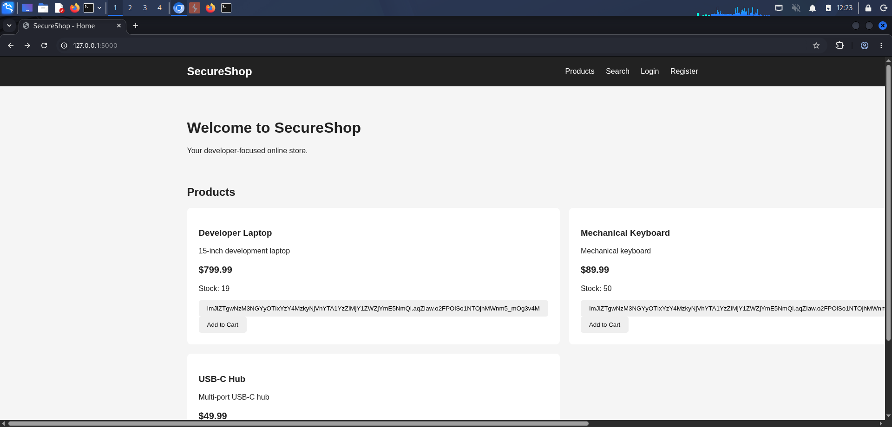
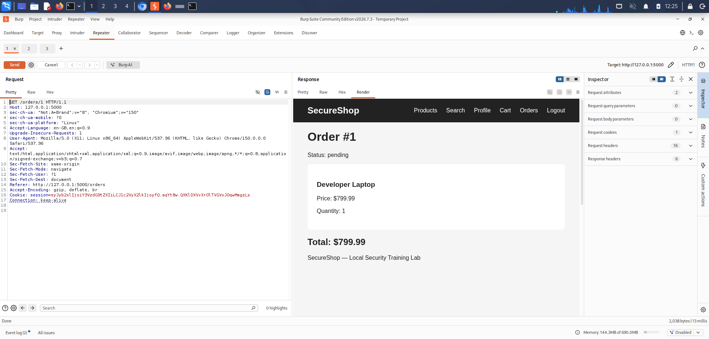
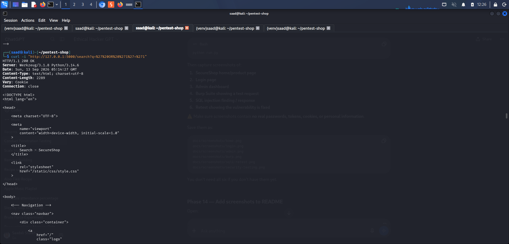
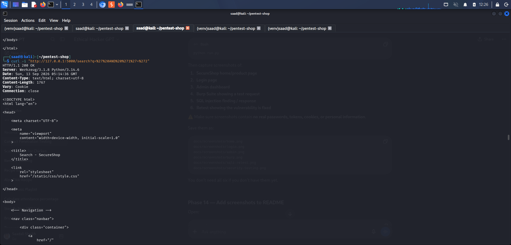
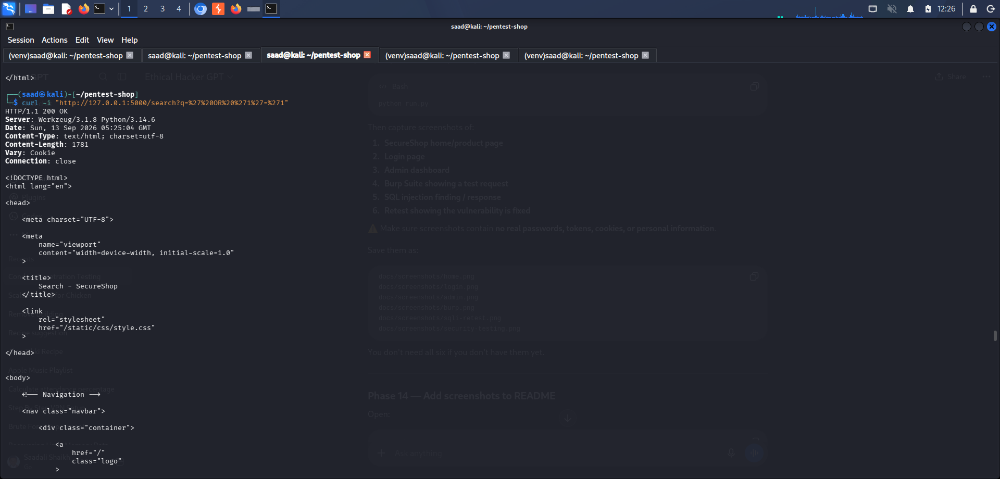

# SecureShop — Web Application Penetration Testing Lab

> An intentionally vulnerable e-commerce application built to demonstrate
> a complete web application security testing and remediation lifecycle.

## Overview

SecureShop is a Python/Flask e-commerce application created as an
authorized local penetration-testing laboratory.

The project demonstrates how an application can be:

1. Built from a secure baseline
2. Intentionally configured with controlled vulnerabilities
3. Assessed using common security tools
4. Remediated
5. Retested
6. Hardened

All testing is performed against the local application.

## Architecture

```text
Browser
   |
   v
Flask Web Application
   |
   +---- Authentication
   +---- Product Catalog
   +---- Search
   +---- Shopping Cart
   +---- Orders
   +---- REST API
   +---- Admin Panel
   |
   v
SQLite Database
## Project Screenshots

### Application Overview



### Security Testing



### SQL Injection Testing



### Reflected XSS Testing



### Security Retesting


